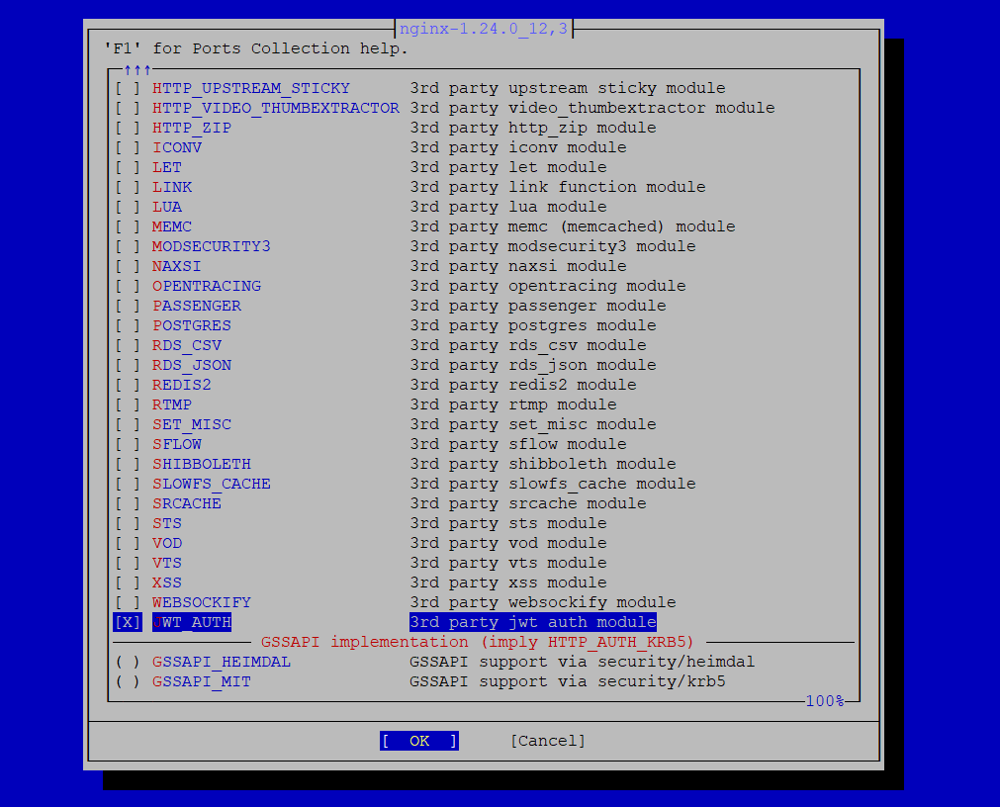

# FreeBSD NGINX server port. Added 3rd party jwt auth module.

## Source of module:
[GitHub - kjdev/nginx-auth-jwt: Nginx module for the authenticate using JWT](https://github.com/kjdev/nginx-auth-jwt)


## PATCH for FreeBSD NGINX server port

1. Fecth ports tree 
`portsnap auto`

2. Apply pathes for files on folder  `/usr/ports/www/nginx`

`patch -p1 < changes.patch`

### Automatic script path
```
cd ~
git clone https://github.com/lexxai/port_nginx_add_jwt_auth
cd ./port_nginx_add_jwt_auth
chmod +x ./apply_changes_nginx_jwt.sh
./apply_changes_nginx_jwt.sh
```

## Build PORT
```
cd  /usr/ports/www/nginx
make config
```
select 'JWT_AUTH' option on menu on 3rd modules


```
make 
make install
```

check if exist file  `/usr/local/libexec/nginx/ngx_http_auth_jwt_module.so`


## How created patch files

### Makefile.extmod

`diff -u Makefile.extmod.or Makefile.extmod > Makefile.extmod.patch`
```
--- Makefile.extmod.or	2023-09-01 15:48:36.000000000 -0400
+++ Makefile.extmod	2023-11-29 22:55:12.496868000 -0500
@@ -13,7 +13,7 @@
	HTTP_UPSTREAM_STICKY HTTP_VIDEO_THUMBEXTRACTOR HTTP_ZIP ICONV LET LINK LUA MEMC \
	MODSECURITY3 NAXSI OPENTRACING PASSENGER POSTGRES RDS_CSV RDS_JSON \
	REDIS2 RTMP SET_MISC SFLOW SHIBBOLETH SLOWFS_CACHE SRCACHE STS \
-	VOD VTS XSS WEBSOCKIFY
+	VOD VTS XSS WEBSOCKIFY JWT_AUTH

 AJP_GH_TUPLE=		msva:nginx_ajp_module:fcbb2cc:ajp
 AJP_VARS=		DSO_EXTMODS+=ajp
@@ -328,3 +328,6 @@

 WEBSOCKIFY_GH_TUPLE=	tg123:websockify-nginx-module:c11bc9a:websockify
 WEBSOCKIFY_VARS=	DSO_EXTMODS+=websockify
+
+JWT_AUTH_GH_TUPLE=	kjdev:nginx-auth-jwt:40c9191:jwt_auth
+JWT_AUTH_VARS=		DSO_EXTMODS+=jwt_auth
```


### Makefile.options.desc

`diff -u Makefile.options.desc.or Makefile.options.desc > Makefile.options.patch`
```
--- Makefile.options.desc.or	2023-11-29 22:59:42.373238000 -0500
+++ Makefile.options.desc	2023-11-29 20:41:06.532553000 -0500
@@ -118,3 +118,4 @@
 WWW_DESC=		Enable html sample files
 XSS_DESC=		3rd party xss module
 WEBSOCKIFY_DESC=	3rd party websockify module
+JWT_AUTH_DESC=		3rd party jwt auth module
```

### pkg-plist
`diff -u pkg-plist.or pkg-plist > pkg-plist.patch`
```
--- pkg-plist.or	2023-05-18 02:30:57.000000000 -0400
+++ pkg-plist		2023-11-29 22:43:57.342592000 -0500
@@ -88,6 +88,7 @@
 %%DSO%%%%VTS%%libexec/nginx/ngx_http_vhost_traffic_status_module.so
 %%DSO%%%%WEBSOCKIFY%%libexec/nginx/ngx_http_websockify_module.so
 %%DSO%%%%XSS%%libexec/nginx/ngx_http_xss_filter_module.so
+%%DSO%%%%JWT_AUTH%%libexec/nginx/ngx_http_auth_jwt_module.so
 %%HTTP_PERL%%%%SITE_ARCH%%/auto/nginx/nginx.so
 %%HTTP_PERL%%%%SITE_ARCH%%/nginx.pm
 sbin/nginx
```

### distinfo

`diff -u distinfo.or distinfo > distinfo.patch`
```
--- distinfo.or		2023-11-29 23:10:24.852421000 -0500
+++ distinfo		2023-11-29 23:10:54.553821000 -0500
@@ -143,4 +143,6 @@
 SIZE (tg123-websockify-nginx-module-c11bc9a_GH0.tar.gz) = 14646
 SHA256 (openresty-xss-nginx-module-v0.06_GH0.tar.gz) = 0b12bbc53a41f3e3d6df419c173b8c87434be3e6cd255a8193aa91345a2de6cf
 SIZE (openresty-xss-nginx-module-v0.06_GH0.tar.gz) = 12448
+SHA256 (kjdev-nginx-auth-jwt-40c9191_GH0.tar.gz) = 0705841c5b281699788f2eecda72962f4082dedf618939b128ef5f997e50e854
+SIZE (kjdev-nginx-auth-jwt-40c9191_GH0.tar.gz) = 61300
```


#### Hash sum
make 


make generate-plist

# TODO: I still need to test the script in action.


